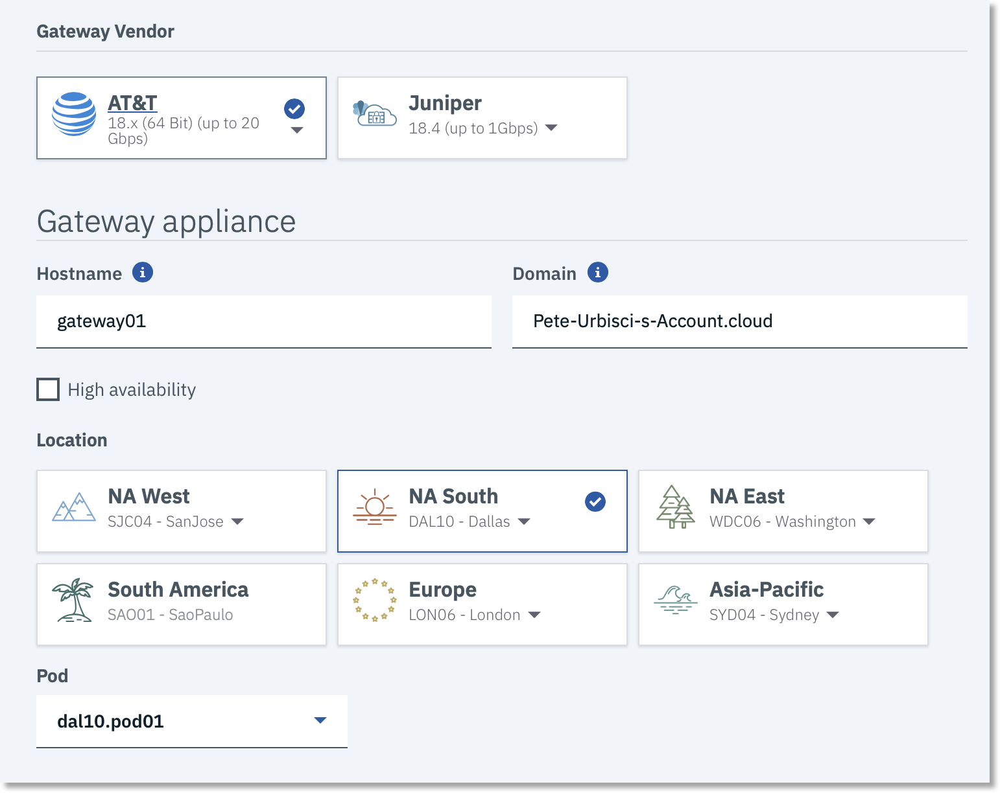
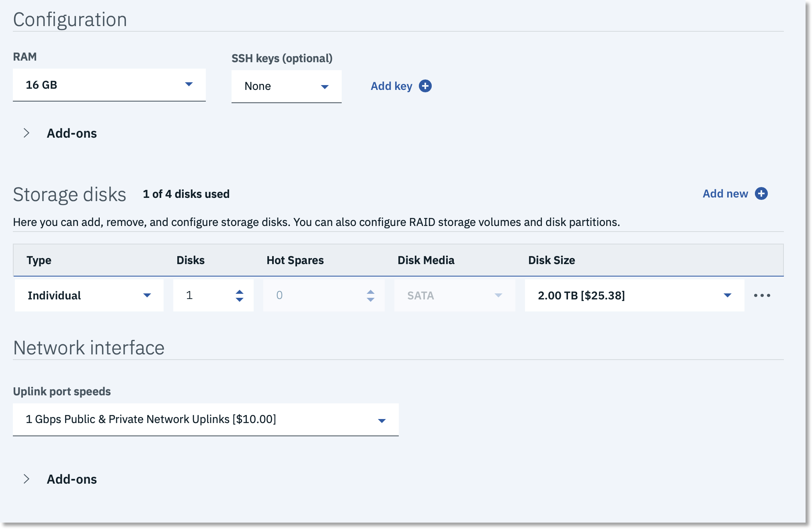

---

copyright:
  years: 2017, 2019
lastupdated: "2021-09-14"

keywords: vra, virtual router appliance

subcollection: virtual-router-appliance

---

{{site.data.keyword.attribute-definition-list}}

# Getting started with IBM Cloud Virtual Router Appliance (VRA)
{: #getting-started}

The {{site.data.keyword.vra_full}} (VRA) provides the latest Vyatta 5600 operating system for x86 bare metal servers. It is offered as a High Availability (HA) or standalone configuration, and lets you route private and public network traffic selectively, through a full-featured enterprise router that has firewall, traffic shaping, policy-based routing, VPN, and other features.
{: shortdesc}

VRA minimum server requirements call for 8 GB of RAM and one CPU core for every 10 Gbps of network capacity. For example, a system with dual 10 Gbps public and private uplinks requires at least four cores. Also, if your intent is to setup VPN services with encryption, you may want to add additional cores. Adding additional cores for VPN Services ensures the VRA does not get bogged down by heavy loads when routing and simultaneously encrypting and decrypting data.

## Ordering an IBM Cloud Virtual Router Appliance
{: #order-vra}

To order a VRA, follow these steps:

1. From your browser, open the Gateway Appliances page in the [IBM Cloud UI console](https://{DomainName}/gen1/infrastructure/provision/gateway){: external} and log in to your account.

   You can also get to this page by selecting the navigation menu in the top left of the [IBM Cloud catalog](https://{DomainName}/){: external} and selecting **Classic Infrastructure > Network > Gateway appliance**.
   {: tip}

2. From the **Gateway Vendor** section, select the **AT&T** option (when it is selected, a blue check mark appears on the button). From the list menu on that same button, choose your bandwidth (either 20Gbps or 2Gbps).

   {: caption="Gateway vendor" caption-side="bottom"}

3. From the **Gateway appliance** section, enter your **Hostname** and **Domain** name information. These fields are already populated with default information, so ensure the values are correct. Check the **High Availability** option if desired, then select your data center **Location**, and the specific **Pod** you want from the list menu.

   Only pods that already have an associated VLAN appear here. If you want to provision your gateway appliance in a pod that you don't see listed, first create a VLAN there.
   {: note}

4. From the **Configuration** section, choose your processor's RAM. You can also define an SSH key if you want to use it to authenticate access to your new gateway.

   {: caption="Configuration" caption-side="bottom"}

   The appropriate processor is chosen for you based on the license version you selected in step 2. However, you can choose different RAM configurations.
   {: note}

5. From the **Storage disks** section, choose the options that meet your storage requirements.

   RAID0 and RAID1 options are available for added protection against data loss, as are hot spares (backup components that can be placed into service immediately when a primary component fails).
   {: note}

   You can have up to four disks per VRA. "Disk size" with a RAID configuration is the usable disk size, because RAID configurations are mirrored.
   {: note}

   Reserve more than the default disk setting if you plan to run network diagnostics that generate detailed logs.
   {: tip}

6. From the **Network interface** section, select your **Uplink port speeds**. The default selection is a single interface, but there are redundant and private only options as well. Choose the one that best fits your needs.

   The Network Interface **Add Ons** section allows you to select an IPv6 address if required, and shows you any additional included default options.

7. Review your selections, check that you have read the Third Party Service Agreements, then click **Create**. The order is verified automatically.

After your order is approved, the provisioning of your {{site.data.keyword.vra_full}} starts automatically. When the provisioning process is complete, the new VRA appears in the Gateway Appliances list page. Click the gateway name to open the Gateway Details page, where you can find the IP addresses, login username, and password for the device.  

   {: caption="Gateway details" caption-side="bottom"}

Remember that after you order and configure your VRA from the IBM Cloud catalog, you must also configure the device itself with the same settings.
{: tip}

## VLANs and the gateway appliance's role
{: #vlans-and-the-gateway-appliance-s-role}

A VLAN (virtual LAN) is a mechanism that segregates a physical network into many virtual segments. For convenience, traffic from multiple selected VLANs can be delivered through a single network cable, a process commonly called "trunking."

{{site.data.keyword.vra_full}} is delivered in two parts: The VRA servers and the gateway appliance fixture. The gateway appliance provides you with an interface (GUI and API) for selecting the VLANs you want to associate with your VRA. Associating a VLAN with a gateway appliance reroutes (or "trunks") that VLAN and all of its subnets to your VRA, giving you control over filtering, forwarding, and protection. For every VLAN that is associated to the gateway appliance, that VLAN is allowed on the switch ports that the VRA is connected to, and any subnet on that VLAN is statically routed to your VRA's public VRRP IP (if the subnet is a public subnet) or statically routed to your VRA's private VRRP IP (if the subnet is a private subnet). This routing is done at the router that the VRA is behind, which is the Frontend Customer Router (FCR) or the Backend Customer Router (BCR) for public and private traffic respectively.

Be aware that VRRP is disabled by default, and it must be enabled in order for VLAN traffic to work, even on stand-alone Vyattas. This is a consequence of the subnets on the associated VLAN's being routed to the VRRP IP or virtual-address assigned to the VRA. For more information, see [VRRP virtual IP (VIP) addresses](/docs/virtual-router-appliance?topic=virtual-router-appliance-working-with-high-availability-and-vrrp#vrrp-virtual-ip-vip-addresses).
{: important}

Servers in an associated VLAN can only be reached from other VLANs by going through your {{site.data.keyword.vra_full}}; it is not possible to circumvent the VRA unless you bypass or disassociate the VLAN.

By default, a new gateway appliance is associated with two non-removable "transit" VLANs, one each for public and private. These are typically used for administration and can be separately secured by VRA commands.

Transit VLANs are for network devices like firewalls or load balancers so that they can route traffic while keeping other devices, such as servers or containers, isolated from the internet.

In comparison, "gateway" VLANs are where devices, such as servers and containers, are hosted.

The VRA can manage only VLANs that are associated with it through the gateway appliance.

For more information, see [Managing VLANs with a gateway appliance](/docs/virtual-router-appliance?topic=gateway-appliance-managing-vlans-and-gateway-appliances).
