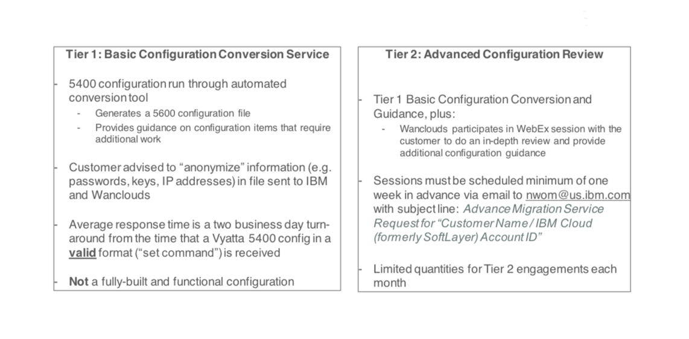

---

copyright:
  years: 2017
lastupdated: "2019-03-14"

keywords: 5400, migrate, migration, support, faqs, eos

subcollection: virtual-router-appliance

---

{:shortdesc: .shortdesc}
{:new_window: target="_blank"}
{:codeblock: .codeblock}
{:pre: .pre}
{:screen: .screen}
{:tip: .tip}
{:download: .download}
{:faq: data-hd-content-type='faq'}
{:note: .note}
{:important: .important}

# Vyatta 5400 End of Support FAQs
{: #vyatta-5400-end-of-support-faqs}

The following are frequently asked questions when migrating from the Vyatta 5400.

## Why is the Vyatta 5400’s “End of Support” (EoS) on March 31, 2019?
{: faq}

September 2017, the legacy Vyatta 5400 announced its EoS to be on February 20, 2018 based on IBM’s lifecycle policy for support:  six months after the General Availability (GA) July date for the next version, the IBM Virtual Router Appliance (VRA).

To honor customer migration timelines, the Vyatta 5400 EoS date was extended to March 31, 2019. Because the Debian 7 software is now no longer supported by the Debian Open Source community, there are no future plans to extend vendor support from AT&T.

[Click here](/docs/infrastructure/virtual-router-appliance?topic=virtual-router-appliance-vyatta-5400-end-of-support-announcement) to view the formal End of Support Announcement.
{: important}

## What does “End of Support” mean for me as a customer?
{: faq}

After the End of Support date, AT&T will no longer provide any code patches or accept support escalations from IBM.

Similarly, IBM Cloud Support will no longer troubleshoot configuration or networking issues on Vyatta 5400 deployments.  Support will be limited to hardware level requests (hard drive, RAM, and so on), power and Out of Band (IPMI) connectivity.

We highly recommend customers take immediate action to migrate onto an alternate solution, such as the Virtual Router Appliance (“VRA”; based on the Vyatta 5600) or Juniper vSRX.  [Click here](/docs/infrastructure/virtual-router-appliance?topic=virtual-router-appliance-migration-overview) to get started.

## What happens if I'm still running my IBM Cloud workloads using a Vyatta 5400 after March 31?
{: faq}

While your Vyatta 5400 will still work after March 31, your business and application environments are exposed to potential security threats and other tampering violations, which may result from latent vulnerabilities in the Vyatta 5400 software.

If you encounter a network issue which takes down your business and application environment, and you trace the root cause to the Vyatta 5400, you should escalate this to our 5400 Offering Manager, as you will not be able to get support from IBM or AT&T. Please reach out to them here:

  nwom@us.ibm.com

## What about my underlying Bare Metal Server hardware – is it still supported?
{: faq}

Hardware replacements are supported, but if trouble-shooting indicates that your problem is related to the Vyatta OS, you will be directed to migrate to a supported hardware offering immediately. [Click here](/docs/infrastructure/virtual-router-appliance?topic=virtual-router-appliance-migration-overview) to get started.

## As a customer who owns a Vyatta 5400, what do I need to do by March 31, 2019?
{: faq}

Customers who have a Vyatta 5400 should migrate to either VRA (Vyatta 5600), Juniper vSRX, or Fortigate Security Appliance (FSA) 10G. The VRA (Vyatta 5600) is still fully supported. There is no current or projected end of support date for the VRA from either IBM Cloud or AT&T. [Click here](/docs/infrastructure/virtual-router-appliance?topic=virtual-router-appliance-migration-overview) to get started.

  VRAs and vSRXs are customer managed devices.
  {: note}

## Is support available from IBM for migrating from the Vyatta 5400 to either the VRA or the vSRX?
{: faq}

The Vyatta 5400 to VRA (5600) Configuration Conversion Service is still available:

* For existing customers, IBM Cloud is providing a no-cost offering to assist with re-factoring your existing Vyatta 5400 configuration into Virtual Router Appliance, Juniper vSRX, or Fortigate Security Appliance (FSA) 10G formats. To submit a request for the Configuration Conversion service, please send an e-mail to nwom@us.ibm.com with the subject: `Request for Configuration Conversion: IBM Cloud Account Number xxxxxx`.

  Be sure to insert your specific account number in place of 'xxxxxx'  in your request.
  {: note}

* Wanclouds, our partner in this conversion configuration process, has completed several hundred successful migration engagements. They will transform your existing Vyatta 5400 to create similar functionality on the Vyatta 5600 Platform. They provide their services in two tiers, described below:

  

[Click here](/docs/infrastructure/virtual-router-appliance?topic=virtual-router-appliance-migration-overview) to get started.

## Are there any additional paid migration services available from IBM Business Partners for migrating off the Vyatta 5400?
{: faq}

We have several business partners who provide paid support for Vyatta 5400 migrations. [Click here](/docs/infrastructure/virtual-router-appliance?topic=virtual-router-appliance-vyatta-5400-end-of-support-announcement) for more information.

## Is there a Vyatta 5400 Offering Management support contact in IBM where I can ask questions related to my Vyatta 5400 migration?
{: faq}

Contact IBM Vyatta 5400 and VRA Network Offering Management with questions at `nwom@us.ibm.com`. You can also contact them using slack with the IBM Watson Cloud Platform workspace: `#vyatta-migration`

## What additional resources are available to help me with this migration?
{: faq}

Review the following Virtual Router Appliance documentation resources for more information:

  * [Getting Started with IBM Virtual Router Appliance](/docs/infrastructure/virtual-router-appliance?topic=virtual-router-appliance-getting-started-with-ibm-virtual-router-appliance)
  * [About the VRA](/docs/infrastructure/virtual-router-appliance?topic=virtual-router-appliance-about-the-vra)
  * [Vyatta 5400 Migration Overview](/docs/infrastructure/virtual-router-appliance?topic=virtual-router-appliance-migration-overview)
