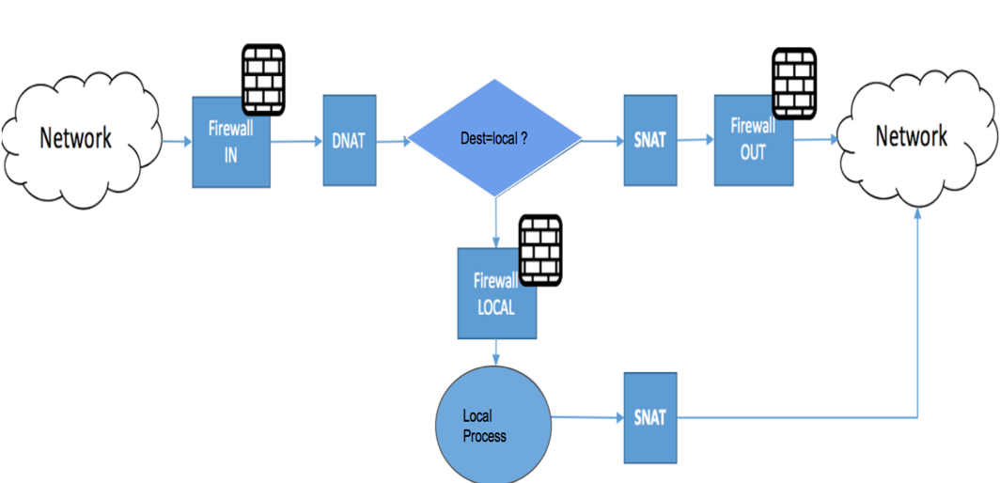

---

copyright:
  years: 2017, 2019
lastupdated: "2019-11-14"

keywords: 

subcollection: virtual-router-appliance

---

{{site.data.keyword.attribute-definition-list}}

# Vyatta 5400 common migration issues
{: #vyatta-5400-common-migration-issues}

The following sections illustrate common issues or behavior changes you might encounter after migrating from a Vyatta 5400 device to a {{site.data.keyword.vra_full}}. In some cases, it includes workarounds to address the issues.
{: shortdesc}

## Interface based global-state policy for stateful firewall
{: #interface-based-global-state-policy-for-stateful-firewall}

### Issues
{: #issues}

The behavior when setting "state-of-state policy" for stateful firewalls from release 5.1 has been changed. In versions prior to release 5.1, if you set `state -global -state -policy` of a stateful firewall, the vRouter automatically added an implicit `Allow` rule for return communication of the session automatically.

In release 5.1 and later, you must add an `Allow` rule setting on the {{site.data.keyword.vra_full}}. The stateful setting works for interfaces on Vyatta 5400 devices, and for protocols on VRA devices.

### Workarounds
{: #workarounds}

If the `firewall-in` rule is applied on an ingress/inside interface, then you must apply the `Firewall-out` rule on the egress/outside interface. Otherwise, return traffic is dropped at the egress/outside interface.        

## State-enable in firewall rules
{: #state-enable-in-firewall-rules}

### State-enable issues
{: #issues-2}

If `global-state-policy` is not configured, this behavior change is not affected. Also, if you are using the `state enable` option in each rule instead of `global-state-policy`, the behavior change is not affected.

## Zone-based policy: Local-zone handling
{: #zone-based-policy-local-zone-handling}

### Local-zone handling issues
{: #issues-3}

There is no "local-zone" pseudo-interface to assign to the zone-policy.

### Local-zone handling workarounds
{: #workarounds-3}

This behavior can be simulated by applying a zone-based firewall to physical interfaces, and an interface-firewall to the loopback interface. The firewall in the loopback interface filters everything that ingress and egress from the router.

For example:

```sh
set security zone-policy zone internal default-action 'drop'
set security zone-policy zone internal description 'Private zone'
set security zone-policy zone internal interface 'dp0bond0'
set security zone-policy zone internal to external firewall 'internal-2-external'
set security zone-policy zone internal to ovpn firewall 'internal-2-ovpn'

set security zone-policy zone ovpn default-action 'drop'
set security zone-policy zone ovpn description 'OpenVPN'
set security zone-policy zone ovpn interface 'vtun0'
set security zone-policy zone ovpn to external firewall 'ovpn-2-external'
set security zone-policy zone ovpn to internal firewall 'ovpn-2-internal'
 
set interfaces loopback lo firewall local 'Local'
 
set security firewall name ovpn-2-external default-action accept
set security firewall name ovpn-2-internal default-action accept
 
set security firewall name external-2-ovpn default-action accept
set security firewall name external-2-internal default-action accept
 
set security firewall name internal-2-external default-action accept
set security firewall name internal-2-ovpn default-action accept
 
set security firewall name Local default-action 'drop'
set security firewall name Local 'default-log'
set security firewall name Local rule 10 action 'accept'
set security firewall name Local rule 10 description 'RIP' ("/opt/vyatta/etc/cpp.conf" )
```
{: screen}

## Order of operation for firewalls, NAT, routing and DNS
{: #order-of-operation-for-firewalls-nat-routing-and-dns}

### Order of operation issues
{: #issues-4}

In a scenario where Masquerade Source NAT is deployed on an {{site.data.keyword.vra_full}}, you cannot use the firewall to determine access for hosts to the internet. This is because the post NAT address is the same.

For Vyatta 5400 devices, this operation was possible because firewalling was done before NAT, allowing the restriction of hosts to access internet.

### Order of operation workarounds
{: #workarounds-4}

A new routing scheme is required for the VRA:

{: caption="Routing scheme" caption-side="bottom"}

## Policy based routing table
{: #policy-based-routing-table}

### Policy based routing table issues
{: #issues-5}

The word "Table" in the configs is optional in v5400 policy-based routing. However, for the VRA, if the action is `accept`, then the **Table** field is mandatory. If the action is `drop` on the VRA config, then the Table field is optional.

### Policy based routing table workarounds
{: #workarounds-5}

"Table Main" is an available option in Vyatta 5400 policy-based routing. The equivalent in VRA is "routing-instance default".

## Policy based routing on the tunnel interface
{: #policy-based-routing-on-tunnel-interface}

### Policy based routing on the tunnel interface issues
{: #issues-6}

On the {{site.data.keyword.vra_full}} PBR (Policy-Based Routing), policies can be applied to data plane interfaces for inbound traffic, but not to loopback, tunnel, bridge, OpenVPN, VTI, and IP unnumbered interfaces.

### Policy based routing on the tunnel interface workarounds
{: #workarounds-6}

There are currently no workarounds for this issue.

## OpenVPN
{: #openvpn}

### OpenVPN issues
{: #issues-8}

OpenVPN does not start working when using the `push-route` parameter on the {{site.data.keyword.vra_full}}.

### OpenVPN workarounds
{: #workarounds-8}

Use the `openvpn-option` parameter instead of `push-route`.

## GRE/VTI over IPSEC + OSPF
{: #gre-vti-over-ipsec-ospf}

### GRE/VTI over IPSEC + OSPF issues
{: #issues-9}

* When VIF has multiple subnets configured, traffic cannot go across those subnets in the VRA.                                             
* InterVlan routing is not working on the VRA.

### GRE/VTI over IPSEC + OSPF workarounds
{: #workarounds-9}

Use implicit allow rules to accept traffic across VIF interfaces.

## IPsec
{: #ipsec}

### IPsec issues
{: #issues-10}

IPsec (prefix-based) does not work with IN Filter.

### IPsec workarounds
{: #workarounds-10}

Use IPsec (VTI BASED).

## IPSEC "match-none"
{: #ipsec-match-none-}

### IPSEC "match-none" issues
{: #issues-11}

With Vyatta 5400 devices, the following firewall rule is allowed:

`set firewall name allow rule 10 ipsec`

However, with {{site.data.keyword.vra_full}}, there is no IPsec.

### IPSEC "match-none" workarounds
{: #workarounds-11}

Possible alternative rules for VRA devices:

```sh
   match-ipsec  Inbound IPsec packets
   match-none   Inbound non-IPsec packets                                                                                                                
```
{: codeblock}

## IPSEC 'match-ipsec"
{: #ipsec-match-ipsec-}

### IPSEC 'match-ipsec" issues
{: #issues-12}

With Vyatta 5400 devices, the following firewall rules are allowed:

```sh
set firewall name OUTSIDE_LOCAL rule 50 action 'accept'
set firewall name OUTSIDE_LOCAL rule 50 ipsec 'match-ipsec'
```
{: codeblock}

However, with {{site.data.keyword.vra_full}}, there is no IPsec.

### IPSEC 'match-ipsec" workarounds
{: #workarounds-12}

Add the protocols `ESP` and `AH` (IP protocols 50 and 51 respectively).

The `action` rule can be either `accept` or `drop`, as shown in the following example:

```sh
set security firewall name <name> rule <rule-no> action accept
set security firewall name <name> rule <rule-no> destination port 500
set security firewall name <name> rule <rule-no> protocol udp
set security firewall name <name> rule <rule-no> action accept
set security firewall name <name> rule <rule-no> destination port 4500
set security firewall name <name> rule <rule-no> protocol udp
set security firewall name <name> rule <rule-no> action accept
set security firewall name <name> rule <rule-no> protocol ah
set security firewall name <name> rule <rule-no> action accept
set security firewall name <name> rule <rule-no> protocol esp
```
{: codeblock}

## Site-to-site IPsec with DNAT
{: #site-to-site-ipsec-with-dnat}

### Site-to-site IPsec with DNAT issues
{: #issues-13}

IPsec (prefix-based) does not work with DNAT.                                                                                                             

```sh
server (10.71.68.245) -- vyatta 1 (11.0.0.1)
===S-S-IPsec=== (12.0.0.1)
vyatta 2 -- client (10.103.0.1)
Tun50 172.16.1.245
```
{: codeblock}

The prior code snippet is a small setup example for DNAT translation after an IPsec packet is decrypted in a Vyatta 5400. In this example, there are two Vyattas, `vyatta1 (11.0.0.1)` and `vyatta2 (12.0.0.1)`. IPsec peering is established between `11.0.0.1` and `12.0.0.1`. In this case, the client is targeting `172.16.1.245` sourced from `10.103.0.1` end-to-end. The expected behavior of this scenario is that the destination address `172.16.1.245` translates to `10.71.68.245` in the packet header.

Initially, the Vyatta 5400 device was performing DNAT on the inbound IPsec, terminating the interface and returning traffic gracefully into the IPsec tunnel using the connection tracking table.

On a {{site.data.keyword.vra_full}}, the configuration does not function the same. The session is created, however the return traffic bypasses the IPsec tunnel after the conntrack table reverses the DNAT change. The VRA then sends the packet on the wire without IPsec encryption. The upstream device is not expecting this traffic and most likely drops it. While end-to-end connectivity is broken, this is intended behavior.   

### Site-to-site IPsec with DNAT workarounds
{: #workarounds-13}

To accommodate this networking scenario, IBM has created an RFE. 

While that RFE is currently being assessed, the following workaround is recommended:

### Interface configuration commands
{: #interface-config-commands}

```sh
set interfaces dataplane dp0p192p1 address '11.0.0.1/30'
set interfaces dataplane dp0p224p1 address '10.0.0.2/30'
set interfaces dataplane dp0p224p1 policy route pbr 'Backwards-DNAT'
set interfaces loopback lo address '169.254.1.1/24'
set interfaces tunnel tun50 address '169.254.240.1/32'
set interfaces tunnel tun50 encapsulation 'gre'
set interfaces tunnel tun50 local-ip '169.254.1.1'
set interfaces tunnel tun50 remote-ip '169.254.1.1'
```
{: codeblock}

### VPN configuration commands
{: #vpn-config-commands}

```sh
set security vpn ipsec esp-group ESP lifetime '30000'
set security vpn ipsec esp-group ESP proposal 1 encryption 'aes128'
set security vpn ipsec esp-group ESP proposal 1 hash 'sha1'
set security vpn ipsec ike-group IKE lifetime '60000'
set security vpn ipsec ike-group IKE proposal 1 encryption 'aes128'
set security vpn ipsec ike-group IKE proposal 1 hash 'sha1'
set security vpn ipsec site-to-site peer 12.0.0.1 authentication mode 'pre-shared-secret'
set security vpn ipsec site-to-site peer 12.0.0.1 authentication pre-shared-secret 'thekey'
set security vpn ipsec site-to-site peer 12.0.0.1 default-esp-group 'ESP'
set security vpn ipsec site-to-site peer 12.0.0.1 ike-group 'IKE'
set security vpn ipsec site-to-site peer 12.0.0.1 local-address '11.0.0.1'
set security vpn ipsec site-to-site peer 12.0.0.1 tunnel 1 local prefix '172.16.1.245/30'
set security vpn ipsec site-to-site peer 12.0.0.1 tunnel 1 remote prefix '10.103.0.0/24'
```
{: codeblock}

### NAT configuration commands
{: #nat-config-commands}

```sh
set service nat destination rule 10 destination address '172.16.1.245'
set service nat destination rule 10 inbound-interface 'tun50'
set service nat destination rule 10 source address '10.103.0.1'
set service nat destination rule 10 translation address '10.71.68.245'
set service nat source rule 10 destination address '10.103.0.1'
set service nat source rule 10 'log'
set service nat source rule 10 outbound-interface 'tun50'
set service nat source rule 10 source address '10.71.68.245'
set service nat source rule 10 translation address '172.16.1.245'
```
{: codeblock}

### Protocols configuration commands
{: #protocols-config-commands}

```sh
set protocols static interface-route 172.16.1.245/32 next-hop-interface 'tun50'
set protocols static table 50 interface-route 0.0.0.0/0 next-hop-interface 'tun50'
```
{: codeblock}

### PBR configuration commands
{: #pbr-config-commands}

```sh
set policy route pbr Backwards-DNAT description 'Get return traffic back to tunnel for DNAT'
set policy route pbr Backwards-DNAT rule 10 action 'accept'
set policy route pbr Backwards-DNAT rule 10 address-family 'ipv4'
set policy route pbr Backwards-DNAT rule 10 destination address '10.103.0.0/24'
set policy route pbr Backwards-DNAT rule 10 source address '10.71.68.0/24'
set policy route pbr Backwards-DNAT rule 10 table '50'
```
{: codeblock}

## PPTP
{: #pptp}

### PPTP issues
{: #issues-13a}

PPTP is no longer supported in the {{site.data.keyword.vra_full}}.                                                                                                                                                   

### PPTP iorkarounds
{: #workarounds-13a}

Use the L2TP protocol instead.

## Script for IPsec restart
{: #script-for-ipsec-restart}

### Script for IPsec restart issues
{: #issues-14}

Whenever a VRRP virtual address is added to an {{site.data.keyword.vra_full}} on a High Availability VPN, you must reinitialize the IPsec daemon. This is because the IPsec service listens only for connections to the addresses that are present on the VRA when the IKE service daemon is initialized.

For a pair of VRAs with VRRP, the standby router might not have the VRRP virtual address that is present on the device during initialization if the master router does not have that address present. Therefore, to reinitialize the IPsec daemon when a VRRP state transition occurs, run the following command on the master and backup routers:

```sh
interfaces dataplane interface-name vrrp vrrp-group group-id notify
```
{: codeblock}

## Recent count and recent time
{: #recent-count-and-recent-time}

### Recent count and recent time issues
{: #issues-15}

The intent of the following rule is to limit SSH connections to 3 every 30 seconds for SSH using any address:

```sh
set firewall name localGateway rule 300 action 'drop'
set firewall name localGateway rule 300 description 'Deter SSH brute force'
set firewall name localGateway rule 300 destination port '22'
set firewall name localGateway rule 300 protocol 'tcp'
set firewall name localGateway rule 300 recent count '3'
set firewall name localGateway rule 300 recent time '30'
set firewall name localGateway rule 300 state new 'enable'
```
{: codeblock}

On the {{site.data.keyword.vra_full}}, this rule has the following issues:

* The option for recent count and recent time has been deprecated.
* Due to the previous issue, the rule cannot function as expected and blocks all SSH connections to the applied interface.

### Recent count and recent time workarounds
{: #workarounds-15}

Use CPP instead.

## Set system conntrack issues
{: #set-system-conntrack-issues}

### Set system conntrack issues issues
{: #issues-16}

```sh
set system conntrack expect-table-size '8192'
set system conntrack hash-size '375000'
set system conntrack modules ftp 'disable'
set system conntrack modules 'gre'
set system conntrack modules h323 'disable'
set system conntrack modules nfs 'disable'
set system conntrack modules pptp 'disable'
set system conntrack modules sip 'disable'
set system conntrack modules sqlnet 'disable'
set system conntrack modules tftp 'disable'
set system conntrack table-size '3000000'
```
{: codeblock}

## Set system conntrack timeout
{: #set-system-conntrack-timeout}

### Set system conntrack timeout issues
{: #issues-17}

```sh
set system conntrack timeout icmp '30'
set system conntrack timeout other '600'
set system conntrack timeout tcp close '10'
set system conntrack timeout tcp close-wait '60'
set system conntrack timeout tcp established '432000'
set system conntrack timeout tcp fin-wait '120'
set system conntrack timeout tcp last-ack '30'
set system conntrack timeout tcp syn-recv '60'
set system conntrack timeout tcp syn-sent '120'
set system conntrack timeout tcp time-wait '60'
```
{: codeblock}

## Time based firewall
{: #time-based-firewall}

### Time based firewall issues
{: #issues-18}

```sh
set firewall name PRIV_SERVICE_IN rule 58 action 'accept'
set firewall name PRIV_SERVICE_IN rule 58 description '586427 Acesso a base de dados ate 22-2-18'
set firewall name PRIV_SERVICE_IN rule 58 destination address '10.150.156.57'
set firewall name PRIV_SERVICE_IN rule 58 destination port '3306'
set firewall name PRIV_SERVICE_IN rule 58 protocol 'tcp'
set firewall name PRIV_SERVICE_IN rule 58 source address '10.150.156.104'
set firewall name PRIV_SERVICE_IN rule 58 time startdate '2017-08-22'
set firewall name PRIV_SERVICE_IN rule 58 time stopdate '2018-02-22'
```
{: codeblock}

## TCP-MSS
{: #tcp-mss-2}

### TCP-MSS issues
{: #issues-19}

```sh
set interfaces tunnel tun3 address '172.17.175.45/30'
set interfaces tunnel tun3 encapsulation 'gre'
set interfaces tunnel tun3 local-ip '169.55.223.76'
set interfaces tunnel tun3 mtu '1476'
set interfaces tunnel tun3 multicast 'disable'
set interfaces tunnel tun3 policy route 'change-mss'(in 18.x unable to apply tcp-mss using PBR only option is to set on interface directly which i believe is not equivalent to pbr .
set interfaces tunnel tun3 remote-ip '104.129.200.34'
```
{: codeblock}

```sh
set policy route change-mss rule 1 protocol 'tcp'
set policy route change-mss rule 1 set tcp-mss '1436'
set policy route change-mss rule 1 tcp flags 'SYN
```
{: codeblock}

## Specific application or port broken in S-S IPsec VPN
{: #specific-application-or-port-broken-in-s-s-ipsec-vpn}

### Specific application or port broken in S-S IPsec VPN issues
{: #issues-19a}

```sh
vyatta@v5600dallas09# set security vpn ipsec site-to-site peer 12.0.0.1 tunnel 1 remote
Possible Completions:
   <Enter> Execute the current command
   port    Any TCP or UDP port
   prefix  Remote IPv4 or IPv6 prefix                                                                                                                                     set security vpn ipsec esp-group ESP lifetime '30000'
set security vpn ipsec esp-group ESP proposal 1 encryption 'aes128'
set security vpn ipsec esp-group ESP proposal 1 hash 'sha1'
set security vpn ipsec ike-group IKE lifetime '60000'
set security vpn ipsec ike-group IKE proposal 1 encryption 'aes128'
set security vpn ipsec ike-group IKE proposal 1 hash 'sha1'
set security vpn ipsec site-to-site peer 12.0.0.1 authentication mode 'pre-shared-secret'
set security vpn ipsec site-to-site peer 12.0.0.1 authentication pre-shared-secret 'thekey'
set security vpn ipsec site-to-site peer 12.0.0.1 default-esp-group 'ESP'
set security vpn ipsec site-to-site peer 12.0.0.1 ike-group 'IKE'
set security vpn ipsec site-to-site peer 12.0.0.1 local-address '11.0.0.1'
set security vpn ipsec site-to-site peer 12.0.0.1 tunnel 1 local prefix '172.16.1.245/30'
set security vpn ipsec site-to-site peer 12.0.0.1 tunnel 1 remote prefix '10.103.0.0/24'                                          set security vpn ipsec site-to-site peer 12.0.0.1 tunnel 1 remote port 21 (ftp)
```
{: codeblock}

## Significant change in logging behavior
{: #significant-change-in-logging-behavior}

### Significant change in logging behavior issues
{: #issues-20}

There is a significant change in logging behavior between the Vyatta 5400 device and the {{site.data.keyword.vra_full}}, from per-session to per-packet logging.

* Session logging: Records stateful session state transitions
* Packet logging: Record all packets that match the rule. Because packet logging is recorded in the log file in "packet units", there is a marked decrease in throughput and the pressure of the disk capacity.
* The logging capability of the vRouter can be used to capture firewall activity. Like any logging function, you should only enable this if you are troubleshooting a particular problem, and disable the logging as soon as you can.

The stateful firewall, which manages Firewall / NAT sessions, writes in "session units". It is recommended to use session logging. Each setting example is described.

#### Session / logging
{: #sl}

* `security firewall session-log <protocol>`
* `system syslog file <filename> facility <facility> level <level>`

#### Packet logging firewall
{: #pack-log}

* `security firewall name <name> default-log <action>`
* `security firewall name <name> rule <rule-number> log`

#### NAT
{: #nat-vra-issues}

* `service nat destination rule <rule-number> log`
* `service nat source rule <rule-number> log PBR`
* `policy route pbr <name> rule <rule-number> log`

#### QoS
{: #qos-issues}

* `policy qos name <policy-name> shaper class <class-id> match <rule-name>`
