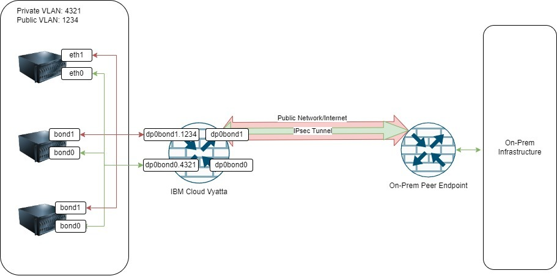
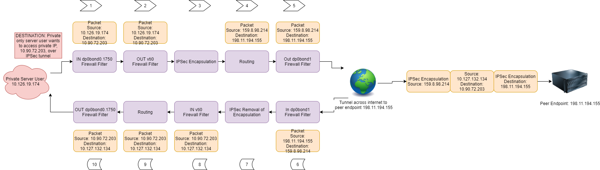

---

copyright:
  years: 2017, 2024
lastupdated: "2024-11-05"

keywords:

subcollection: virtual-router-appliance

---

{{site.data.keyword.attribute-definition-list}}

# Configuring and troubleshooting IPSec tunnels
{: #vra-config-ipsec}

IPSec tunnels are used to securely connect private space subnets (rfc1918) over a negotiated connection between two routers or firewalls (commonly called peer endpoints with reference to IPSec). Generally, the two peer endpoints have network connectivity to each other through the internet. If they don't have a direct connection over the internet, one or both peers may be behind NAT/port forwarding. NAT traversal must be enabled in your configurations. I

In the IBM Cloud environment specifically, the Vyatta (or other classic gateway appliance) is used as the IBM Cloud classic infrastructure side peer endpoint. The remote endpoint (with reference to IBM Cloud) is a router or firewall on the "on-prem" side. 

The following figure shows a very basic visual representation of an IPSec tunnel, from IBM Cloud Classic to on-prem, over the internet. 

{: caption="Figure 1: Vyatta basic IPSec tunnel configuration" caption-side="bottom"}

## Route-based and policy-based IPSec
{: #route-based-vs-policy-based}

With route-based IPSec, you do not configure traffic selectors (also called local and remote prefixes) and instead configure a VTI interface. In addition, you manually configure static routes for remote subnets with a next hop set to that interface. 

For policy-based IPSec on the Vyatta, you configure local and remote prefixes and do not configure a routeable interface for the tunnel. The VFP interface was added as a feature in order to add a routeable interface to policy-based IPSec configurations. This eliminates the need to migrate to a route-based configuration in order to utilize NAT and more granular firewall rules with policy-based tunnels.

To learn more about the differences between route-based and policy based IPSec, refer to [IPsec site-to-site VPN configuration options](https://docs.vyatta.com/en/supported-platforms/vrouter/configuration-vrouter/security-and-vpn/ipsec-site-to-site-vpn/ipsec-site-to-site-vpn-configuration/ipsec-site-to-site-vpn-configuration-options){: external} article. 

### Route-based IPSec configuration example
{: #route-based-example}

The following example is a route-based configuration running in the IBM Cloud classic infrastructure environment:

#### West side
{: #west-side-route-based-config}

```ssh
#PHASE 1
set security vpn ipsec ike-group IKE-Fergie ike-version 2
set security vpn ipsec ike-group IKE-Fergie lifetime 28800
set security vpn ipsec ike-group IKE-Fergie proposal 1 dh-group 20
set security vpn ipsec ike-group IKE-Fergie proposal 1 encryption aes256
set security vpn ipsec ike-group IKE-Fergie proposal 1 hash sha2_256
 
#PHASE 2
set security vpn ipsec esp-group ESP-Fergie pfs dh-group20
set security vpn ipsec esp-group ESP-Fergie proposal 1 encryption aes128gcm128
set security vpn ipsec esp-group ESP-Fergie proposal 1 hash null
set security vpn ipsec esp-group ESP-Fergie lifetime 3600

#Tie it all together configuration
set security vpn ipsec site-to-site peer 159.8.98.213 authentication id 169.50.194.197
set security vpn ipsec site-to-site peer 159.8.98.213 authentication mode pre-shared-secret
set security vpn ipsec site-to-site peer 159.8.98.213 authentication pre-shared-secret '*********'
set security vpn ipsec site-to-site peer 159.8.98.213 authentication remote-id 159.8.98.213
set security vpn ipsec site-to-site peer 159.8.98.213 ike-group IKE-Fergie
set security vpn ipsec site-to-site peer 159.8.98.213 local-address 169.50.194.197
set security vpn ipsec site-to-site peer 159.8.98.213 vti bind vti2
set security vpn ipsec site-to-site peer 159.8.98.213 vti esp-group ESP-Fergie

#VTI INTERFACE CREATION
set interfaces vti vti2 address 172.16.0.5/30

#STATIC ROUTE CREATION FOR REMOTE PREFIX
set protocols static interface-route 10.127.132.128/26 next-hop-interface vti2

#HA considerations - group number can be different on each Vyatta
set interfaces bonding dp0bond1 vrrp vrrp-group 2 notify 'ipsec'
 
#IKEv2 considerations
set security vpn ike make-before-break
```
{: codeblock}

#### East Side 
{: #East-side-route-based-config}

```sh
#PHASE 1
set security vpn ipsec ike-group IKE-Fergie ike-version 2
set security vpn ipsec ike-group IKE-Fergie lifetime 28800
set security vpn ipsec ike-group IKE-Fergie proposal 1 dh-group 20
set security vpn ipsec ike-group IKE-Fergie proposal 1 encryption aes256
set security vpn ipsec ike-group IKE-Fergie proposal 1 hash sha2_256

#PHASE 2
set security vpn ipsec esp-group ESP-Fergie pfs dh-group20
set security vpn ipsec esp-group ESP-Fergie proposal 1 encryption aes128gcm128
set security vpn ipsec esp-group ESP-Fergie proposal 1 hash null
set security vpn ipsec esp-group ESP-Fergie lifetime 3600

#Tie it all together configuration
et security vpn ipsec site-to-site peer 169.50.194.197 authentication id 159.8.98.213
set security vpn ipsec site-to-site peer 169.50.194.197 authentication mode pre-shared-secret
set security vpn ipsec site-to-site peer 169.50.194.197 authentication pre-shared-secret '*********'
set security vpn ipsec site-to-site peer 169.50.194.197 authentication remote-id 169.50.194.197
set security vpn ipsec site-to-site peer 169.50.194.197 ike-group IKE-Fergie
set security vpn ipsec site-to-site peer 169.50.194.197 local-address 159.8.98.213
set security vpn ipsec site-to-site peer 169.50.194.197 vti bind vti2
set security vpn ipsec site-to-site peer 169.50.194.197 vti esp-group ESP-Fergie

#VTI INTERFACE CREATION
set interfaces vti vti2 address 172.16.0.6/30

#STATIC ROUTE CREATION FOR REMOTE PREFIX
set protocols static interface-route 10.165.125.112/28 next-hop-interface vti2

#HA considerations - group number can be different on each Vyatta
set interfaces bonding dp0bond1 vrrp vrrp-group 1 notify 'ipsec'
 
#IKEv2 considerations
set security vpn ike make-before-break
```
{: codeblock}

## Interface-based firewalls with route-based IPsec
{: #interface-firewall-route-ipsec}

When applying firewall rulesets to your interfaces, be aware of what the source and destination IPs of a packet will be when going into and out of an interface. The following diagram illustrates a typical packet traversing the Vyatta on the forward and return path through an IPSec tunnel. 

{: caption="Figure 2: IPSec traffic flows" caption-side="bottom"}

The OUT direction for a VTI is where the packet will be encrypted and sent out of the Vyatta. The IN direction for a VTI is where the packet will be decrypted and sent to the server behind the Vyatta. For the outside interface, `dp0bond1`, the packet will always be the peer endpoint IP addresses. The port/protocols are ESP, UDP port 500 and UDP port 4500 (if you use NAT-T). 

The sourece IP and destination IP in a packet for the IN direction for a VLAN interface (VIF) should match the OUT direction for the VTI.
{: note}

The following firewall rule logs illustrate the flow:

```sh
May 25 05:34:07 gateway02 dataplane[4391]:  In:dp0bond1 PASS fw rule PubIn:1 proto=(other/50) addr=198.11.194.155->159.8.98.214 macs=e4:c7:22:63:b5:41->0:0:5e:0:1:2 v4=(len:156,ttl:241,tos:00,ecn:Not,prot:50,hl:5)
May 25 05:34:07 gateway02 dataplane[4391]:  In:vti0 PASS fw rule INipsecvti0:10 proto=(icmp/1) addr=10.90.72.203->10.126.19.174 v4=(len:84,ttl:63,tos:00,ecn:Not,prot:1,hl:5) icmp=(EchoRq,type:8,code:0)
May 25 05:34:07 gateway02 dataplane[4391]: Out:dp0bond0.1750 PASS fw rule OUTipsec1750:10 proto=(icmp/1) addr=10.90.72.203->10.126.19.174 v4=(len:84,ttl:62,tos:00,ecn:Not,prot:1,hl:5) icmp=(EchoRq,type:8,code:0)
May 25 05:34:07 gateway02 dataplane[4391]:  In:dp0bond0.1750 PASS fw rule INipsec1750:10 proto=(icmp/1) addr=10.126.19.174->10.90.72.203 v4=(len:84,ttl:64,tos:00,ecn:Not,prot:1,hl:5) icmp=(EchoRp,type:0,code:0)
May 25 05:34:07 gateway02 dataplane[4391]: Out:vti0 PASS fw rule OUTipsecvti0:10 proto=(icmp/1) addr=10.126.19.174->10.90.72.203 v4=(len:84,ttl:63,tos:00,ecn:Not,prot:1,hl:5) icmp=(EchoRp,type:0,code:0)
May 25 05:34:07 gateway02 dataplane[4391]: Out:dp0bond1 PASS fw rule PubOut:1 proto=(other/50) addr=159.8.98.214->198.11.194.155 v4=(len:156,ttl:255,tos:00,ecn:Not,prot:50,hl:5)
```
{: screen}

## Zone-based firewalls with route-based IPSec
{: zone-based-fw-ipsec}

For zone-based firewalls, the policies that you define should assume that traffic flows between the VTI interface and the VRA's local private VLAN interace (VIF). You do not need to define a policy between the VTI and the `dp0bond1` zones.

## Basic troubleshooting
{: #troubleshooting-process}

To troubleshoot IPSec tunnel configuration issues, run through the following process:

1. Reset tunnels and restart the VPN. 
   
   Do this first if you can, as this can save time during an outage. Ensure you remember what each command is restarting and its effect on the rest of the tunnels.

1. Check for end-to-end network connectivity between peers. 

   Ensure that UDP ports 500 and 4500 (if using NAT-T), and the ESP protocol are allowed on the outside interface for both peers. 
   {: important}
   
1. Check phase 1 status. A "Down" status could mean:
   * You did not check step 2 
   * There are mismatching IKE versions, encryption algorythms, hash algorythms, or IKE Identifiers
   * There are vendor incompatibilities
1. Check phase 2 status. A "Down" status (or no status at all) could mean: 
   * Phase 1 is down
   * There are mismatching encryption algorythms, hash algorythms, traffic selectors, or dh-groups
   * There are vendor incompatabilities
1. Parse through available IPsec logs for signs of the issue. The logs can give you exact information on mismatches and help you solve the issue quickly.
1. Review the [VRA software patches](/docs/virtual-router-appliance?topic=virtual-router-appliance-ciena-vyatta-5600-vrouter-software-patches) for information on common bugs. You can also request a comprehensive PDF from IBM Cloud Security Support.

### Troubleshooting commands
{: #troubleshooting-commands}

To check phase 1 status:

```sh
show vpn ike sa
show vpn ike sa peer <Peer IP>
```
{: codeblock}

Sample output:

```sh
vyatta@siferguson-par01-02:~$ show vpn ike sa peer 169.50.194.197
Peer ID / IP                            Local ID / IP
------------                            -------------
169.50.194.197                          159.8.98.213

    State    Encrypt       Hash    D-H Grp  A-Time  L-Time IKEv
    -----  ------------  --------  -------  ------  ------ ----
    up     aes256        sha2_256  14       2154    3600    2
```
{: screen}

To check phase 2 status:

```sh
show vpn ipsec sa
show vpn ipsec sa peer <Peer IP>
```
{: codeblock}

Sample output:

```sh
vyatta@siferguson-par01-02:~$ show vpn ipsec sa peer 169.50.194.197
Peer ID / IP                            Local ID / IP
------------                            -------------
169.50.194.197                          159.8.98.213

    Tunnel  Id          State  Bytes Out/In   Encrypt       Hash      DH A-Time  L-Time
    ------  ----------  -----  -------------  ------------  --------  -- ------  ------
    vti     44          up     284.3M/27.2G   aes128gcm128  null      n/a 2131    300
```
{: screen}

To quickly show a set of detailed information on a specific peer connection:

```sh
show vpn debug peer <Peer IP>
```
{: codeblock}

Sample output:

```sh
vyatta@siferguson-par01-02:~$ show vpn debug peer 169.50.194.197
peer-169.50.194.197:  159.8.98.213...169.50.194.197  IKEv2
peer-169.50.194.197:   local:  [159.8.98.213] uses pre-shared key authentication
peer-169.50.194.197:   remote: [169.50.194.197] uses pre-shared key authentication
peer-169.50.194.197-tunnel-vti:   child:  0.0.0.0/0 === 0.0.0.0/0 TUNNEL
peer-169.50.194.197[48]: ESTABLISHED 38 minutes ago, 159.8.98.213[500][159.8.98.213]...169.50.194.197[500][169.50.194.197]
peer-169.50.194.197[48]: IKEv2 SPIs: 65967eb4beab8549_i 1eacdfa5f926b9a3_r*, pre-shared key reauthentication in 13 minutes
peer-169.50.194.197[48]: IKE proposal: AES_CBC_256/HMAC_SHA2_256_128/PRF_HMAC_SHA2_256/MODP_2048
peer-169.50.194.197-tunnel-vti{44}:  INSTALLED, TUNNEL, reqid 1, ESP SPIs: 9796e1b4_i db89cc43_o
peer-169.50.194.197-tunnel-vti{44}:  AES_GCM_16_128, 31436172664 bytes_i, 322001309 bytes_o, rekeying active
peer-169.50.194.197-tunnel-vti{44}:   0.0.0.0/0 === 0.0.0.0/0
```
{: screen|

To show and parse available IPSec logs:

```sh
show log vpn ipsec
show log vpn ipsec subsystem ike-sa site-to-site peer <Peer IP>
journalctl -f -u strongswan #This live follows the end of the journal logs for ipsec
journalctl -u strongswan > /home/vyatta/journalctl-ipsec-$(date +%Y%m%d) #this creates a file so that you can parse/grep through the logs without them rotating
```
{: codeblock}

To reset the IPSec tunnels:

```sh
 reset vpn ipsec-peer <Peer IP> #reset all tunnels/phase 2's on this peer
 reset vpn ipsec-peer <Peer IP> tunnel <tunnel id> #reset phase 2 tunnel for only the specified tunnel on the specified peer
 restart vpn #This restarts the entire IPSec VPN subsystem - this affects all tunnels on all peers
 ```

## Common Issues
{: #common-issues}

The following list provides some common issues you may encounter with IPSec tunnels.

* There are mismatching phase 1 and phase 2 parameters between the two peers.
* There are mismatching IKE versions.
* Phase 1 fails with an authentication error while everything seems to match.
   - Enure that you set the authentication ID and remote ID to the local and remote IP addresses.
* ESP and UDP ports 500 and 4500 are not allowed on outside interfaces.
   - Ensure ESP and port 500 are allowed. If you're using NAT-T, ensure UDP 4500 is allowed.
* Ciena recommends that you use the line `set security vpn ike make-before-break` when you are using IKEv2. Omitting this line can cause outages.
* Thoroughput is slow. 
   - Use either the aes128gcm or aes256gcm as the phase 2 encryption algorythm. This can greatly increase throughput if the previous encryption algorythm was the standard AES128 or AES256. 
   - Disable per packet logging if it is implemented. Per packet firewall logging can decrease throughput.
* IPSec tunnels are working, but then on rekey they go down.
   - Check that PFS and dh-groups match on both peers.
* The `show vpn ipsec sa` command shows increments in only one direction. 
   - This is usually caused by asymmetrical routing, where one side is sending data through the tunnel and the other is not.
*  Using run-transition-scripts for HA failover instead of the replacement `notify` command. 
   - For more information, refer to [VRA upgrade issues](/docs/virtual-router-appliance?topic=virtual-router-appliance-upgrade-issues#Common-Issues-1912-to-2012).

## Additional resources
{: #resources}

The following list provides some additional resources when configuring and troubleshooting IPSec tunnels:

* [IPSec site-to-site VPN configuration options](https://docs.vyatta.com/en/supported-platforms/vrouter/configuration-vrouter/security-and-vpn/ipsec-site-to-site-vpn/ipsec-site-to-site-vpn-configuration/ipsec-site-to-site-vpn-configuration-options){: external}
* [IPsec Site-to-Site VPN Configuration Guide, 17.2.0](https://public.dhe.ibm.com/cloud/bluemix/network/vra/18_ipsec_site-to-site_vpn_configuration_5600.pdf){: external}
* [IPsec Site-to-Site VPN configuration guide, addendum 1801](https://public.dhe.ibm.com/cloud/bluemix/network/vra/18_ipsec_site-to-site-configuration_5600_addendum.pdf){: external}
* [Internet Key Exchange Protocol Version 2 (IKEv2)](https://datatracker.ietf.org/doc/html/rfc5996){: external}
* [IP Encapsulating Security Payload (ESP)](https://datatracker.ietf.org/doc/html/rfc4303){: external}
